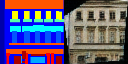
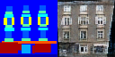
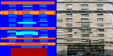
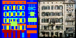
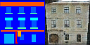
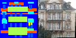
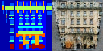
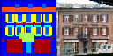

# mxnet-image-to-image

Image to Image translation using MXNet and GAN

### Pixel-to-Pixel GAN

To run [Pixel2PixelGan](mxnet_img_to_img/library/pixel2pixel.py) using 
the [facade dataset](http://cmp.felk.cvut.cz/~tylecr1/facade/) dataset, run the following command:

```bash
python demo/pixel2pixel_gan_train.py
```

The [demo/pixel2pixel_gan_train.py](demo/pixel2pixel_gan_train.py) sample codes are shown below:

```python
import os
import sys
import mxnet as mx


def patch_path(path):
    return os.path.join(os.path.dirname(__file__), path)


def main():
    sys.path.append(patch_path('..'))

    output_dir_path = patch_path('models')

    from mxnet_img_to_img.library.pixel2pixel import Pixel2PixelGan
    from mxnet_img_to_img.data.facades_data_set import load_image_pairs

    img_pairs = load_image_pairs(patch_path('data/facades'))
    gan = Pixel2PixelGan(model_ctx=mx.gpu(0), data_ctx=mx.gpu(0))
    gan.img_width = 64  # default value is 256, too large for my graphics card memory
    gan.img_height = 64  # default value is 256, too large for my graphics card memory
    gan.num_down_sampling = 5  # default value is 8, too large for my graphics card memory

    gan.fit(image_pairs=img_pairs, model_dir_path=output_dir_path)


if __name__ == '__main__':
    main()

```

The trained models will be saved into [demo/models](demo/models) folder with prefix "pixel-2-pixel-gan-*"

To run the trained models to generate new images:

```bash
python demo/pixel2pixel_gan_generate.py
```

The [demo/pixel2pixel_gan_generate.py](demo/pixel2pixel_gan_train.py) sample codes are shown below:

```python
import os
import sys
import mxnet as mx
from random import shuffle
import numpy as np


def patch_path(path):
    return os.path.join(os.path.dirname(__file__), path)


def main():
    sys.path.append(patch_path('..'))

    model_dir_path = patch_path('models')

    from mxnet_img_to_img.library.pixel2pixel import Pixel2PixelGan
    from mxnet_img_to_img.data.facades_data_set import load_image_pairs
    from mxnet_img_to_img.library.image_utils import load_image, visualize

    img_pairs = load_image_pairs(patch_path('data/facades'))

    gan = Pixel2PixelGan(model_ctx=mx.gpu(0), data_ctx=mx.gpu(0))
    gan.load_model(model_dir_path)

    shuffle(img_pairs)

    for source_img_path, _ in img_pairs[:20]:
        source_img = load_image(source_img_path, gan.img_width, gan.img_height)
        target_img = gan.generate(source_image=source_img)
        img = mx.nd.concat(source_img.as_in_context(gan.model_ctx), target_img, dim=2)
        # img = ((img.asnumpy().transpose(1, 2, 0) + 1.0) * 127.5).astype(np.uint8)
        visualize(img)


if __name__ == '__main__':
    main()
```

Below is some output images generated:

|   |  |  |
|   |  |  |
|   |  |  |


# Note

### Training with GPU

Note that the default training scripts in the [demo](demo) folder use GPU for training, therefore, you must configure your
graphic card for this (or remove the "model_ctx=mxnet.gpu(0)" in the training scripts). 


* Step 1: Download and install the [CUDA® Toolkit 9.0](https://developer.nvidia.com/cuda-90-download-archive) (you should download CUDA® Toolkit 9.0)
* Step 2: Download and unzip the [cuDNN 7.0.4 for CUDA@ Toolkit 9.0](https://developer.nvidia.com/cudnn) and add the
bin folder of the unzipped directory to the $PATH of your Windows environment 

